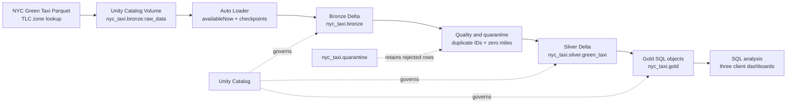
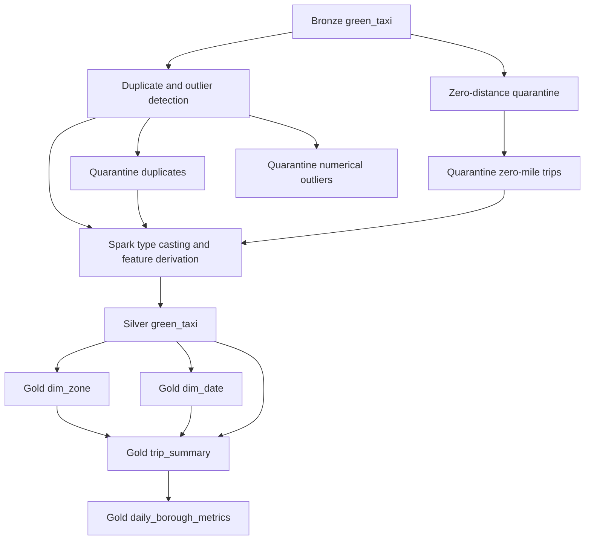
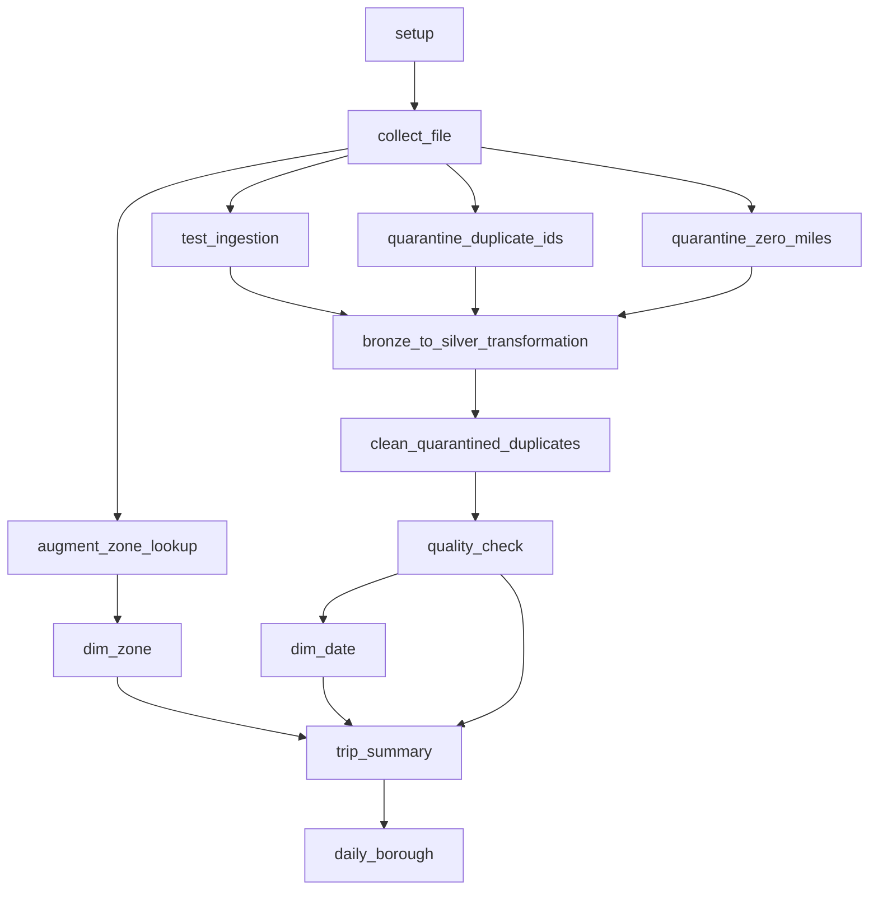

# NYC Taxi Lakehouse on Databricks

## Purpose

This project migrates the YG-Pipeline NYC Taxi workload from an on-premises platform based on ClickHouse, Spark, Docker, and Terraform to Databricks. The current implementation focuses on reliable ingestion, data quality, medallion storage, orchestration, and Gold-layer analytics.

The repository is intentionally small. It demonstrates the lakehouse design and deployment workflow without claiming to be a production-scale fleet dispatch platform.

## Current Architecture

### Implemented components

- **Unity Catalog Volume:** stores downloaded source Parquet files and Auto Loader metadata.
- **Auto Loader:** ingests new files incrementally into Bronze Delta tables.
- **Spark notebooks:** standardize types, derive trip features, apply quality rules, and publish Silver data.
- **Quarantine notebooks:** preserve duplicate business keys, zero-distance, and reversed/refund records for investigation.
- **Cleanup and quality checks:** remove quarantined duplicate IDs from Silver and report inferred-value counts before Gold publication.
- **Numerical outlier policy:** quarantine extreme distances, durations, fares, tips, tolls, passenger counts, and negative monetary values with explicit reasons.
- **Databricks SQL tasks:** build Gold dimensions, trip summary, and borough performance metrics.
- **Databricks Asset Bundles:** define deployment targets and job workflows in `databricks.yml` and `resources/`.

## Ingestion Architecture

The project has two complementary ingestion workflows.

### Targeted download

`download_files` accepts `month`, `year`, `base_url`, and `raw_path` job parameters. It checks whether the requested file already exists in the Volume and downloads it only when needed.

### Historical backfill

`backfill_download` uses a `for_each_task` with month/year objects for every month from 2020 through 2026. Each iteration invokes `download_files` with its own period. This creates a repeatable backfill without duplicating download logic.

### Incremental ingestion

`etl_job` watches the raw Volume for file arrival. Its ingestion notebook uses Auto Loader with `availableNow=True`, schema evolution, and checkpoint paths in the Volume. This processes all currently available files and terminates, which is appropriate for scheduled or file-arrival-triggered workloads.

This is not a `COPY INTO` implementation. The backfill job downloads source files, while Auto Loader performs the table ingestion.

## Transformation Architecture

### Bronze

Bronze preserves the source-oriented Green Taxi and zone lookup data. It is the replay and traceability layer and should not be treated as a clean analytics contract.

### Silver

`nyc_taxi.silver.green_taxi` casts source types, normalizes categorical values, derives `trip_id`, duration, fare-per-mile, tip percentage, and time features, then filters invalid analytical records. Duplicate `trip_id` values, invalid timestamps, zero-distance trips, and trips over 24 hours are excluded from the analytical Silver output. Negative monetary records are flagged as reversed and written to quarantine before exclusion. Imputation flags record when passenger, payment, or rate-code values were inferred; invalid rate codes map to `0` (`Unknown`).

Numerical outliers are written to `nyc_taxi.quarantine.taxi_numerical_outliers_latest` with an `outlier_reason` value before exclusion.

### Gold

The SQL layer creates:

- `nyc_taxi.gold.dim_zone`: zone, borough, region, and zone-type attributes.
- `nyc_taxi.gold.dim_date`: calendar and holiday attributes for 2020–2026.
- `nyc_taxi.gold.trip_summary`: an enriched trip-level view joining Silver to both dimensions.
- `nyc_taxi.gold.daily_borough_metrics`: daily borough-level KPIs such as trips, revenue, tips, duration, distance, and anomaly count.

## Job Orchestration

The ingestion test validates that raw data and Bronze data exist and that the Bronze table contains the source columns. It does not require equal total row counts because Auto Loader is incremental and Bronze can contain prior batches.

## Governance and Observability

Unity Catalog is the governance foundation for catalog, schema, table, Volume, and lineage boundaries. The project creates these schemas:

- `nyc_taxi.bronze`
- `nyc_taxi.silver`
- `nyc_taxi.gold`
- `nyc_taxi.quarantine`

The current implementation provides basic data-quality outputs and job-run visibility. Role-specific views, sensitive-field masking, retention policies, system-table dashboards, and Lakehouse Monitoring remain production hardening work rather than completed features.

## Migration Mapping

| On-premises component | Databricks replacement |
| --- | --- |
| ClickHouse analytical tables | Delta tables and views in Unity Catalog |
| Spark execution | Databricks Spark notebooks and SQL tasks |
| Docker runtime | Databricks-managed job execution and SQL Warehouse tasks |
| Terraform deployment | Databricks Asset Bundles |
| Manually managed storage | Unity Catalog Volumes and schemas |
| Custom pipeline orchestration | Databricks Jobs task dependencies and triggers |

## Planned Extensions

- Databricks dashboards for borough revenue and zone demand.
- Hourly underserved/adequate/saturated zone classification.
- For-hire vehicle ingestion and taxi-versus-FHV competitive analytics.
- Stronger role-based access, retention, masking, and audit reporting.

These extensions should consume the existing Gold contracts rather than bypass the medallion layers.

## Design Goals

- Keep raw data replayable and traceable.
- Make incremental ingestion safe to rerun.
- Quarantine questionable records instead of silently losing them.
- Keep business-facing Gold objects stable and understandable.
- Deploy the same workflow consistently through Databricks Asset Bundles.
- Distinguish implemented behavior from future production capabilities.
