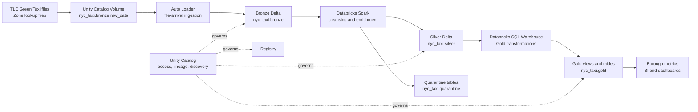
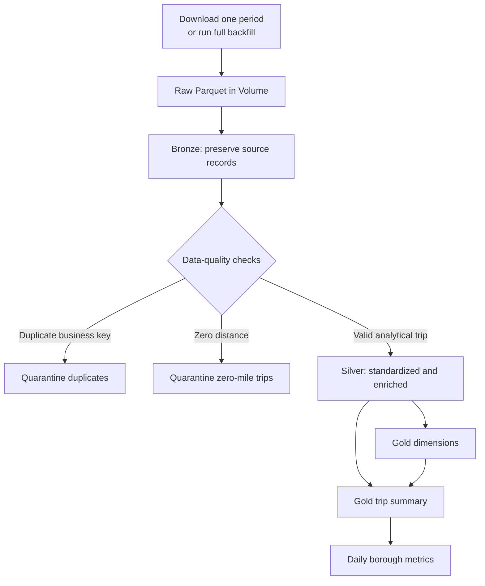
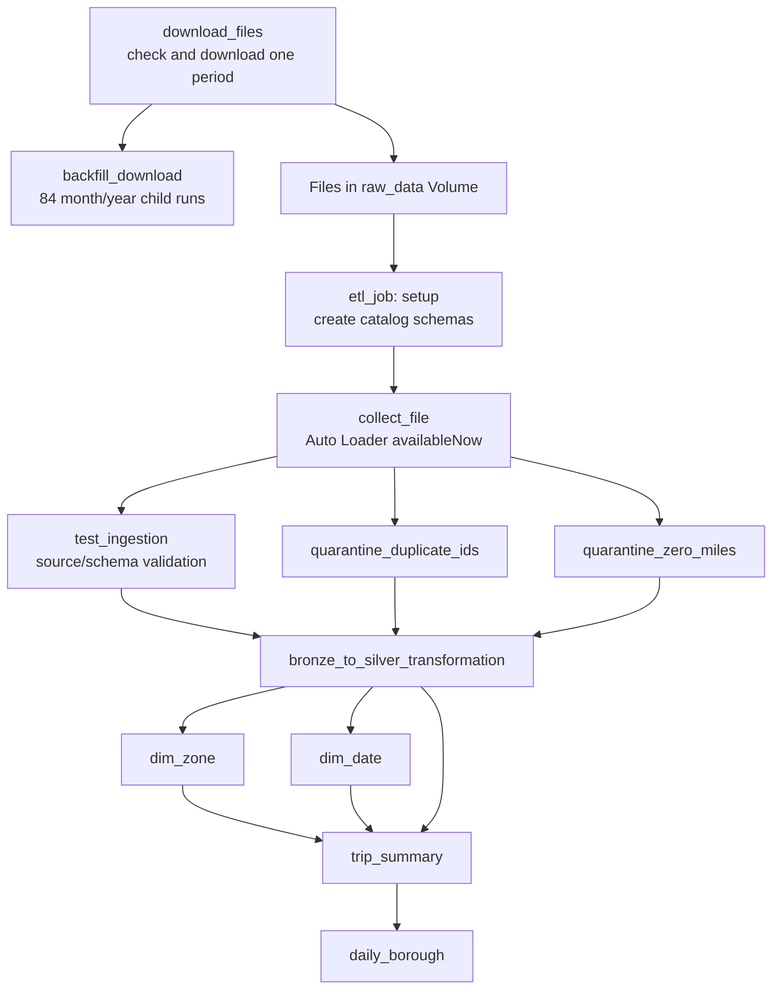

# NYC Taxi Operations Intelligence Platform

This project is a Databricks migration of an on-premises NYC Taxi analytics
platform ( YG-PIPELINE ). It turns NYC Taxi and Limousine Commission trip records into governed
data products for fleet operations, finance, compliance, and strategic planning.

## Executive Summary

The platform transforms raw trip records into trusted analytics for fleet
deployment, financial reporting, anomaly detection, and service-quality
monitoring. Automated ingestion, data cleansing, enrichment, aggregation, and
governance replace manual spreadsheet workflows with reusable lakehouse data
products. Fleet managers can identify demand patterns, finance teams can review
borough performance, and compliance teams can investigate unusual fares using a common source of truth.

## Business Problem

NYC taxi operators manage thousands of vehicles across more than 260 zones.
They need reliable answers to four operational questions:

- **Where should vehicles be deployed?** Empty cruising and vehicle clustering
  reduce earnings and increase customer wait times.
- **Which fares need investigation?** Unusual fare, distance, or duration
  patterns may indicate data errors, meter issues, or route anomalies.
- **Can service coverage be demonstrated?** Borough and zone-level reporting
  must be repeatable rather than assembled manually from raw exports.
- **How is the taxi network performing against other mobility providers?**
  Comparing taxi and for-hire vehicle coverage is a planned extension of the
  platform.

## Stakeholders and Value

| Stakeholder             | Information needed                               | Value delivered                                    |
| ----------------------- | ------------------------------------------------ | -------------------------------------------------- |
| Fleet manager           | Demand and revenue by zone and time              | Better vehicle placement and less empty cruising   |
| Finance analyst         | Daily trips, revenue, tips, and revenue per trip | Faster and more consistent reporting               |
| Compliance officer      | Data-quality and service-coverage evidence       | Repeatable investigations and regulatory reporting |
| Operations lead         | Duration, distance, and anomaly trends           | Earlier visibility into service degradation        |
| Strategic planning team | Taxi versus FHV coverage                         | Better incentive, marketing, and market decisions  |

## Data Products

### 1. Trip Summary

A clean, enriched trip-level dataset with timestamps, zones, boroughs,
time-of-day attributes, payment descriptions, derived measures, and anomaly
flags. It gives analysts a reliable starting point for ad hoc questions without
repeating raw-data cleanup.

### 2. Daily Borough Performance

Daily metrics include trip volume, fare revenue, tips, total revenue, average
tip percentage, average duration, average distance, zones with pickups, and
revenue per trip. These metrics support daily operational and finance reviews.

### 3. Zone and Demand Analytics

The gold layer includes zone and borough dimensions that support demand and
revenue analysis by location. An hourly demand heatmap and underserved,
adequate, or saturated classifications are planned next, using the same
enriched trip foundation.

### 4. Service Quality and Anomaly Monitoring

The Silver layer flags extreme distances and high-value fares while filtering
invalid timestamps, negative monetary values, zero-distance trips, and repeated
business keys from analytical outputs. Suspicious records remain available in
the quarantine layer for investigation.

### 5. FHV Competitive Intelligence

Comparison of yellow taxi trips with for-hire vehicle dispatch feeds is a
planned data product. It will compare coverage, volume, and revenue by zone and
date once the FHV source is connected.

## Current Implementation

The current repository implements the NYC Green Taxi pipeline and zone
reference data:

- Raw Parquet files arrive in a Unity Catalog Volume.
- Auto Loader incrementally ingests records into the Bronze layer ( triggered by file arrival).
- Spark notebooks standardize types, derive trip metrics, filter invalid rows,
  and quarantine duplicates, zero-distance, and reversed/refund records.
- Cleanup and quality-check notebooks run before Gold publication and report
  inferred-value counts for auditability.
- The zone lookup is downloaded and materialized through one canonical Bronze
  path before the Gold zone dimension is built.
- SQL tasks build Gold dimensions and the trip summary and borough metrics.
- Databricks Asset Bundles deploy and orchestrate the jobs.

FHV ingestion, dashboards, automated role-specific views, retention policies,
and query-level audit reporting are documented target capabilities rather than
completed features in this repository.

## Architecture and Data Flow

| Stage         | What happens                                                                      | Business meaning                                   |
| ------------- | --------------------------------------------------------------------------------- | -------------------------------------------------- |
| Raw ingestion | Trip files and lookup data are collected automatically                            | No repeated manual uploads                         |
| Bronze        | Source data is stored with incremental ingestion and checkpoints                  | Original records remain available for traceability |
| Silver        | Types are standardized; invalid, duplicate, and zero-distance records are handled | Analysts work from trusted records                 |
| Gold          | Dimensions and daily metrics are materialized from Silver                         | Dashboards and reports load quickly                |
| Governance    | Catalog, schema, table, and deployment boundaries are defined in Databricks       | Access and lineage can be managed centrally        |

The project uses a Bronze, Silver, and Gold medallion architecture with Delta
tables in Unity Catalog:

- `nyc_taxi.bronze`: ingested trip and zone data
- `nyc_taxi.silver`: cleaned and enriched trips
- `nyc_taxi.gold`: dimensions, trip summaries, and reporting metrics
- `nyc_taxi.quarantine`: duplicate and zero-distance records retained for review

## Architecture Views

### Platform Architecture



### Medallion Data Flow



### Job Orchestration



The current implementation includes the ingestion, medallion, and orchestration
paths shown above. Hourly dispatch recommendations,
dashboard delivery, and FHV competitive intelligence are planned extensions.

## Data Schemas and Contracts

All data objects use the `nyc_taxi` Unity Catalog. The `init.ipynb` notebook
creates the `bronze`, `silver`, `gold`, and `quarantine` schemas and the
`bronze.raw_data` Volume.

### Bronze Schema

| Object | Type | Purpose |
| --- | --- | --- |
| `nyc_taxi.bronze.raw_data` | Volume | Landing area for downloaded Parquet files and Auto Loader checkpoints |
| `nyc_taxi.bronze.green_taxi` | Delta table | Raw Green Taxi trip records ingested by Auto Loader |
| `nyc_taxi.bronze.zone_lookup` | Delta table | TLC location reference data used to resolve zone IDs |

The Green Taxi source contains the TLC fields used by the pipeline, including
`VendorID`, `lpep_pickup_datetime`, `lpep_dropoff_datetime`, `store_and_fwd_flag`,
`RatecodeID`, `PULocationID`, `DOLocationID`, `passenger_count`, `trip_distance`,
`fare_amount`, `extra`, `mta_tax`, `tip_amount`, `tolls_amount`,
`improvement_surcharge`, `total_amount`, `payment_type`, and `trip_type`, plus
the source coordinate fields when present.

### Silver Schema

`nyc_taxi.silver.green_taxi` is the cleaned and enriched trip contract. Its
published columns are:

| Column group | Columns |
| --- | --- |
| Identity and timestamps | `trip_id`, `vendor_id`, `pickup_datetime`, `dropoff_datetime` |
| Trip measures | `trip_duration_minutes`, `trip_distance`, `fare_per_mile`, `passenger_count` |
| Locations | `PULocationID`, `DOLocationID` |
| Payment and fare | `rate_code_id`, `payment_type`, `tip_amount`, `tip_percentage`, `fare_amount`, `extra`, `mta_tax`, `improvement_surcharge`, `tolls_amount`, `total_amount` |
| Source attributes | `store_and_fwd_flag`, `trip_type` |
| Time features | `pickup_hour`, `pickup_day_of_week` |
| Quality | `anomaly_flag`, `outlier_reason`, `is_reversed` |

Silver rules remove invalid timestamps, zero-distance trips, trips longer than
24 hours, and repeated `trip_id` business keys from the analytical table.
Negative fare/total records are marked with `is_reversed` and written to
`nyc_taxi.quarantine.taxi_reversed_latest` before exclusion. The contract also
records `passenger_count_was_imputed`, `payment_type_was_imputed`, and
`rate_code_was_imputed` so inferred values are auditable. Invalid rate codes
use `0`, which is labeled `Unknown`.

Numerical outliers are excluded from Silver and written to
`nyc_taxi.quarantine.taxi_numerical_outliers_latest`. The current policy flags
trip distance over 100 miles, duration over 1,440 minutes, fare or total amount
over $500, tips or tolls over $200, invalid passenger counts, and negative
monetary values. Each quarantined row contains an `outlier_reason` string.

### Gold Schema

#### `nyc_taxi.gold.dim_zone`

The zone dimension is built from `bronze.zone_lookup`:

`zone_key`, `borough`, `zone_name`, `region_group`, `zone_type`, `is_manhattan`

#### `nyc_taxi.gold.dim_date`

The date dimension covers 2020 through 2026 and contains:

`date_key`, `year`, `month`, `month_of_year`, `month_name`, `day_of_month`,
`day_of_week`, `day_name`, `is_weekend`, `week_of_year`, `quarter`,
`quarter_year`, `is_us_holiday`

#### `nyc_taxi.gold.trip_summary`

This view joins Silver trips to both dimensions. It publishes date attributes,
time-of-day classification, pickup and dropoff zone attributes, trip measures,
payment labels, rate labels, and anomaly status:

`trip_date`, `year`, `month`, `month_name`, `day_of_week`, `day_name`,
`is_weekend`, `quarter`, `is_us_holiday`, `pickup_hour`, `time_of_day`,
`pickup_zone_key`, `pickup_borough`, `pickup_zone`, `pickup_region_group`,
`pickup_zone_type`, `pickup_is_manhattan`, `dropoff_zone_key`, `dropoff_borough`,
`dropoff_zone`, `dropoff_region_group`, `trip_duration_minutes`, `trip_distance`,
`passenger_count`, `fare_amount`, `extra`, `mta_tax`, `improvement_surcharge`,
`tip_amount`, `tolls_amount`, `total_amount`, `fare_per_mile`, `tip_percentage`,
`payment_type`, `payment_type_name`, `rate_code_id`, `rate_type_name`,
`anomaly_flag`

#### `nyc_taxi.gold.daily_borough_metrics`

This materialized view aggregates the trip summary by date and pickup borough:

`trip_date`, `borough`, `total_trips`, `total_fare_revenue`, `total_tip_revenue`,
`total_revenue`, `avg_tip_pct`, `avg_duration_min`, `avg_distance_mi`,
`zones_with_pickups`, `revenue_per_trip`, `anomaly_count`

### Quarantine Schema

Quarantine tables preserve records for investigation instead of silently
discarding them:

- `nyc_taxi.quarantine.taxi_trips_duplicates_latest` contains all rows sharing
  the duplicate business key and includes the derived `trip_id`.
- `nyc_taxi.quarantine.taxi_zero_miles_latest` contains Bronze rows where
  `trip_distance = 0`.
- `nyc_taxi.quarantine.taxi_reversed_latest` contains rows with negative fare
  or total amounts and the `is_reversed` flag.
- `nyc_taxi.quarantine.taxi_numerical_outliers_latest` contains numerical
  outliers and their `outlier_reason` values.
- Timestamped copies are also written for each run, using names such as
  `taxi_trips_duplicates_<timestamp>` and `taxi_zero_miles_<timestamp>`.

## Migration From On-Premises

| Previous platform | Databricks implementation |
| --- | --- |
| ClickHouse analytical tables | Delta tables governed by Unity Catalog |
| Apache Spark jobs | Databricks Spark notebooks and SQL tasks |
| Docker-based execution | Databricks-managed job compute and SQL Warehouses |
| Terraform infrastructure | Databricks Asset Bundle configuration in `databricks.yml` and `resources/` |
| Manually managed medallion storage | Unity Catalog schemas and Delta Lake |

The migration preserves the original business purpose while consolidating
execution, orchestration, storage, governance, and deployment on Databricks.
The project remains intentionally small and is designed to demonstrate the
lakehouse approach rather than reproduce a production-scale fleet platform.

## Governance and Compliance Direction

The target operating model includes:

- Role-based access for analysts, engineers, and compliance users.
- Masking or exclusion of sensitive driver information when such fields are
  introduced.
- Retention rules for analyst-facing views.
- Reproducible audit evidence showing the data and logic behind a metric.
- Quarantine and data-quality outputs for invalid or suspicious records.

Unity Catalog provides the foundation for these controls. The role-specific
views, retention automation, and full audit workflow remain implementation work
for a production deployment.

## Expected Business Outcomes

The intended outcomes are:

| Metric                  | Current direction                                                  |
| ----------------------- | ------------------------------------------------------------------ |
| Daily revenue reporting | Replace manual spreadsheet assembly with pre-computed Gold metrics |
| Anomaly detection       | Move from periodic sampling to repeatable daily flagging           |
| Compliance reporting    | Produce consistent borough and zone evidence from governed tables  |
| Ad hoc analysis         | Reduce time spent cleaning and joining raw trip files              |
| Fleet deployment        | Provide the foundation for hourly zone demand recommendations      |

Production ROI figures should be measured after dashboards, dispatch feeds,
and operational baselines are connected. The percentages in the business
concept are target outcomes, not measured results from the current repository.

## Repository Structure

- `src/`: Databricks notebooks and Gold SQL queries.
- `resources/`: Databricks job definitions.
- `databricks.yml`: Databricks Asset Bundle configuration and targets.
- `tests/`: Local test configuration.
- `fixtures/`: Test data fixtures.
- `ARCHITECTURE.md`: Detailed technical architecture notes.

## Getting Started

Install the project dependencies with [uv](https://docs.astral.sh/uv/):

```bash
uv sync --dev
```

Authenticate with the [Databricks CLI](https://docs.databricks.com/dev-tools/cli/databricks-cli.html),
then deploy the development target:

```bash
databricks bundle deploy -t dev
```

Run the ETL job:

```bash
databricks bundle run etl_job -t dev
```

Run local tests:

```bash
uv run pytest
```

The production target is available through the same bundle workflow:

```bash
databricks bundle deploy -t prod
```

## User Guide: Download and Backfill Data

The project exposes two download workflows:

- `backfill_download` downloads every month from 2020 through 2026. It runs
  one child download job for each month/year combination.
- `download_files` downloads one specific month and year. The job checks the
  Volume first and skips the download when the file is already present.

### Run the Complete Backfill

After deployment, run the full 84-period backfill:

```bash
databricks bundle run backfill_download -t dev
```

The backfill uses the configured source URL and Volume path from `databricks.yml`.
Auto Loader processes newly downloaded files when `etl_job` runs.

### Download One Month and Year

Pass both values as job parameters. Months must use two digits:

```bash
databricks bundle run download_files -t dev \
  --params "month=11,year=2021"
```

The default `base_url` and `raw_path` values are used automatically. To override
them, include all parameters in the same comma-separated argument:

```bash
databricks bundle run download_files -t dev \
  --params "month=11,year=2021,base_url=https://d37ci6vzurychx.cloudfront.net/trip-data/,raw_path=/Volumes/nyc_taxi/bronze/raw_data"
```

### Download Every Month for One Year

To process all twelve months for a selected year, run the single-period job in
a Bash loop. This is useful when you do not want to launch the complete
2020–2026 backfill:

```bash
for month in {01..12}; do
  databricks bundle run download_files -t dev \
    --params "month=${month},year=2021"
done
```

After downloading data, run the ETL job to ingest and transform it:

```bash
databricks bundle run etl_job -t dev
```
